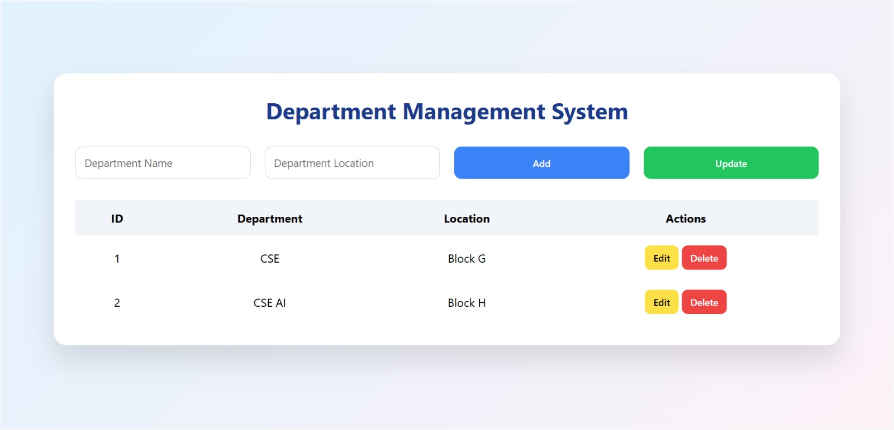

# 🏢 Department Management System

A **full-stack Department Management System** developed using **Spring Boot REST API** for the backend and **HTML, CSS, and JavaScript** for the frontend.  
The application allows users to perform complete **CRUD operations** (Create, Read, Update, Delete) on department data through a clean, animated, and user-friendly UI.

---

## ✨ Features

- ➕ Add new departments  
- 📋 View all departments  
- ✏️ Update existing department details  
- 🗑️ Delete departments  
- 🌐 RESTful API architecture  
- 🎨 Elegant, light-colored, animated frontend UI  
- 🗄️ In-memory H2 database (no external DB required)

---

## SnapShot Of my project 

  

## 🛠️ Tech Stack

### Backend
- Java  
- Spring Boot  
- Spring Data JPA  
- H2 Database  
- RESTful Web Services  

### Frontend
- HTML  
- CSS  
- JavaScript (Fetch API)

